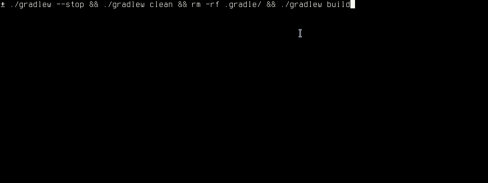

# gradle-8.10.1-build-issue-demo

Steps to reproduce:

```
./gradlew --stop && ./gradlew clean && rm -rf .gradle/ && ./gradlew build
```

This should yield:
```
FAILURE: Build failed with an exception.

* What went wrong:
Could not determine the dependencies of task ':cleanup-lambda:compileKotlin'.
> Could not create task ':cleanup-lambda:checkKotlinGradlePluginConfigurationErrors'.
   > DefaultTaskCollection#configureEach(Action) on task set cannot be executed in the current context.
```
(if not, try again)



To "fix" the issue, downgrade to gradle 8.10 in `gradle/wrapper/gradle-wrapper.properties`.

Side note: I tried to remove more dependencies / config from the build.gradle.kts (obviously I did not try all possible
combinations / lines to remove), but then the issue did not occur anymore. But I could not find a root cause for this issue.
